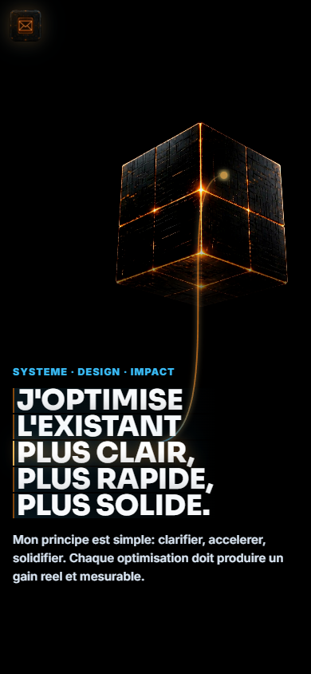

# Site Ma Méthode - Hub des projets et vitrine interactive

## Rapport complet

Ce depot public presente le concept, les fonctions, les choix de conception, les outils utilises, les commandes locales et les captures d'ecran de l'application. Il est genere par l'orchestrateur uniquement apres validation de publication publique.

## Concept

Un hub centralisé et immersif présentant les projets sous forme de grille navigable avec des fiches détaillées, synchronisé avec l'orchestrateur Cerveau IA.

Centraliser et diffuser de manière claire et immersive les projets développés, en offrant une navigation intuitive et des informations structurées pour les visiteurs, partenaires et clients. Le projet transforme des données brutes en une présentation visuelle et cohérente, tout en garantissant la confidentialité des informations sensibles.

Public vise: Visiteurs du site, partenaires potentiels, clients, équipes internes et toute personne souhaitant consulter les projets de manière structurée et visuelle.


## Fonctionnement de l'application

Le site charge un registre de projets (project-registry.js) contenant les métadonnées des projets (noms, statuts, liens, familles, etc.). Une grille interactive affiche les projets sous forme de cartes positionnées dans des zones prédéfinies. L'utilisateur peut zoomer, se déplacer et cliquer sur une carte pour ouvrir une fiche détaillée. La scène de contact, basée sur WebGL, permet d'envoyer des messages via une API PHP dédiée. Toutes les interactions sont vérifiées pour éviter l'exposition de données sensibles.

## Fonctions de l'application

- Affichage d'une grille interactive des projets
- Navigation par zoom et déplacement dans la grille
- Ouverture de fiches détaillées pour chaque projet
- Affichage des statuts, liens publics et GitHub (quand autorisés)
- Présentation de la méthode de travail via une narration immersive
- Filtres visuels par familles de projets
- Intégration de vignettes générées par IA
- Module de contact interactif avec vérification navigateur
- Affichage dynamique d'une grille de projets synchronisée avec l'orchestrateur
- Navigation immersive avec zoom et déplacement
- Ouverture de fiches détaillées par projet avec sections structurées
- Affichage des vignettes générées par IA
- Vérification automatique de la compatibilité des navigateurs
- Responsive design pour une utilisation sur mobile et desktop

## Actualisations et evolution

- Intégration d'un registre de projets généré automatiquement par l'orchestrateur pour éviter la maintenance manuelle des cartes
- Ajout d'une scène de contact interactive basée sur WebGL pour une expérience immersive
- Optimisation des vignettes en format WebP pour un chargement plus rapide
- Mise en place d'une vérification automatisée des navigateurs via Playwright pour garantir la compatibilité
- Enrichissement du README avec des rapports fonctionnels et des captures d'écran pour une meilleure documentation
- Statut courant: PUBLIC_READY.
- Securite: OK_PUBLIC.
- Fonctionnement: FONCTIONNEL.
- Intégration d'un registre de projets généré automatiquement pour éviter la maintenance manuelle
- Ajout d'une scène de contact interactive basée sur WebGL
- Optimisation des vignettes en WebP pour un chargement plus rapide
- Mise en place d'une vérification automatisée des navigateurs via Playwright
- Enrichissement du README avec des rapports fonctionnels et des captures d'écran

## Comment le projet a ete reflechi et construit

Le projet a été conçu comme un hub vivant plutôt qu'une simple liste statique, afin de faciliter la mise à jour et la synchronisation avec les données de l'orchestrateur. La structure repose sur un module JavaScript modulaire (main.js) qui gère la grille, les interactions et l'affichage des fiches. Le design immersif utilise du CSS responsive et des animations contrôlées par le scroll pour une expérience utilisateur fluide. Les choix techniques incluent l'utilisation de Vite pour le développement, Node.js pour le serveur local, et des outils comme Playwright pour les tests automatisés. Les vignettes sont générées par IA et optimisées en WebP pour un rendu performant.

Cette section doit expliquer les choix qui ont guide le projet: besoin de depart, structure retenue, modules principaux, compromis techniques, interface ou logique metier, et raisons des outils utilises.

### Outils, IA et moteurs utilises

- Vite (serveur de développement et bundler)
- Node.js (runtime pour le serveur local)
- Playwright (vérification automatisée des navigateurs)
- API PHP dédiée pour le module de contact
- WebGL (pour la scène de contact interactive)
- Registre de projets généré par l'orchestrateur (project-registry.js)
- JavaScript modulaire (ES Modules)
- CSS responsive immersif avec animations contrôlées par le scroll
- Format d'images WebP pour l'optimisation
- CSS avec animations contrôlées par le scroll
- WebGL pour les scènes interactives
- Format WebP pour les images
- Vérification des secrets et données sensibles via scripts dédiés
- Génération automatique du registre de projets

### Options techniques detectees

- Type de projet: node
- Gestionnaire: npm
- Nom package: ai-video-webgl-competences-clean
- Version: 1.0.0
- Lien public: https://cv.c2rdesign.com/
- Statut securite: OK_PUBLIC

### Stack et dependances principales

- Vite/Dev server
- Node.js
- JavaScript modulaire (ES Modules)
- CSS avec animations contrôlées par le scroll
- WebGL pour les scènes interactives
- Format WebP pour les images
- Vérification des secrets et données sensibles via scripts dédiés
- Génération automatique du registre de projets

### Scripts disponibles

- check: node --check scripts/serve.mjs && node --check scripts/qa-iphone.mjs && node --check src/contact-scene.js && node --check src/main.js && node --check src/project-registry.js
- dev: node scripts/serve.mjs
- dev:iphone: node scripts/serve.mjs --host 0.0.0.0
- qa:iphone: node scripts/qa-iphone.mjs
- qa:iphone:headed: node scripts/qa-iphone.mjs --headed
- serve: node scripts/serve.mjs
- start: node scripts/serve.mjs

### Dependances applicatives

- Aucune dependance applicative detectee.

### Dependances de developpement

- Aucune dependance de developpement detectee.

## Automatisations et comportements internes

- Génération automatique du registre de projets (project-registry.js) à partir des données de l'orchestrateur
- Copie des fiches Markdown publiques vers le dossier de publication
- Synchronisation des statuts, liens et vignettes avec les données de l'orchestrateur
- Vérification du rendu via Playwright pour garantir la compatibilité
- Contrôle des données sensibles pour éviter leur exposition

## Installation locale

[object Object]

### Pre-requis
- Node.js installe localement.
- Gestionnaire detecte: npm.
- Creer un fichier `.env` local a partir de `.env.example` si des variables sont necessaires.

### Commandes
```powershell
npm install
npm run dev
npm run start
```

### Scripts utiles
- check: node --check scripts/serve.mjs && node --check scripts/qa-iphone.mjs && node --check src/contact-scene.js && node --check src/main.js && node --check src/project-registry.js
- dev: node scripts/serve.mjs
- dev:iphone: node scripts/serve.mjs --host 0.0.0.0
- qa:iphone: node scripts/qa-iphone.mjs
- qa:iphone:headed: node scripts/qa-iphone.mjs --headed
- serve: node scripts/serve.mjs
- start: node scripts/serve.mjs

## Lancement

```powershell
npm run dev
npm run start
```

## Utilisation

Après installation, accéder au site via un navigateur en local (par défaut sur `http://localhost:3000`). La grille s'affiche avec les projets positionnés. Utiliser la molette de la souris pour zoomer, les flèches ou un cliqué-glissé pour se déplacer, et cliquer sur une carte pour ouvrir sa fiche détaillée. Les fiches contiennent des sections comme 'Application', 'Fonctionnement', 'Conception', etc., ainsi que des liens publics et GitHub si disponibles. La scène de contact permet d'envoyer un message après interaction avec l'interface WebGL.

## Captures d'ecran




## Variables d'environnement

Copier `.env.example` vers `.env` en local puis remplir les valeurs privees.

## Securite

Ne jamais publier `.env`, tokens, sessions, logs sensibles, cles privees ou donnees personnelles.
