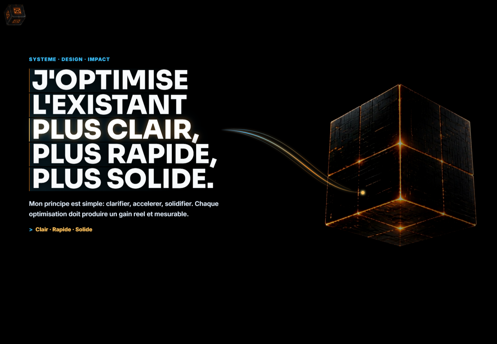

# Site Ma Methode

## Rapport complet

Ce depot public presente le concept, les fonctions, les choix de conception, les outils utilises, les commandes locales et les captures d'ecran de l'application. Il est genere par l'orchestrateur uniquement apres validation de publication publique.

## Concept

Vitrine interactive et hub des projets. Elle presente la methode de travail, affiche la carte des applications et ouvre des fiches detaillees synchronisees par l'orchestrateur.

Transformer les projets locaux en presentation claire, navigable et diffusable.

Public vise: Visiteurs, partenaires, clients potentiels et suivi personnel.


## Fonctionnement de l'application

Le site importe un module project-registry.js genere par l'orchestrateur. A l'ouverture de la grille, il place les projets par zones, gere le zoom, le deplacement, les boutons de focus et le panneau detail. Quand une carte est ouverte, le panneau affiche l'image, le resume, les statuts, le lien public, le lien GitHub, la fiche, puis les sections Application, Fonctionnement, Conception, Techniques et Automatisations. Le contact passe par une scene interactive et une API PHP dediee.

## Fonctions de l'application

- Affiche une grille navigable de tous les projets.
- Ouvre une fiche simple et lisible pour chaque application.
- Montre les liens publics disponibles quand ils sont autorises.
- Garde les informations sensibles hors de la vitrine.
- Presenter la methode de travail
- Ouvrir une carte interactive des projets
- Filtrer visuellement par familles de projets
- Afficher une fiche detaillee par application
- Donner le lien public et GitHub quand ils sont autorises
- Afficher les vignettes generees
- Envoyer un message via le contact
- Garder les contenus sensibles hors de la vitrine

## Actualisations et evolution

- README public enrichi avec rapport fonctionnel, captures GitHub et details de conception.

## Options et conception

Il a ete concu comme un hub vivant plutot qu'une liste statique. Le design existant garde la narration immersive, mais la couche projet est maintenant alimentee par les donnees de l'orchestrateur pour eviter de recoder les cartes a la main et pour garder les projets synchronises.

### Outils, IA et moteurs utilises

- Registre fourni par l'orchestrateur
- Fiches Markdown publiques
- Vignettes IA WebP
- Panneau detail dynamique
- Scene contact interactive
- API PHP de contact
- Verification navigateur automatisee
- Regles de non-exposition des secrets
- Vite
- JavaScript modulaire
- CSS responsive immersif
- Video controlee par le scroll
- WebGL pour la scene contact
- Registre JavaScript genere
- Images WebP optimisees
- Verification navigateur avec Playwright

### Options techniques detectees

- Type de projet: node
- Gestionnaire: npm
- Nom package: ai-video-webgl-competences-clean
- Version: 1.0.0
- Lien public: https://cv.c2rdesign.com/
- Statut securite: OK_PUBLIC

### Stack et dependances principales

- Vite/Dev server
- Node.js
- Vite
- JavaScript modulaire
- CSS responsive immersif
- Video controlee par le scroll
- WebGL pour la scene contact
- Registre JavaScript genere
- Fiches Markdown publiques
- Images WebP optimisees
- Verification navigateur avec Playwright

### Scripts disponibles

- check: node --check scripts/serve.mjs && node --check scripts/qa-iphone.mjs && node --check src/contact-scene.js && node --check src/main.js && node --check src/project-registry.js
- dev: node scripts/serve.mjs
- dev:iphone: node scripts/serve.mjs --host 0.0.0.0
- qa:iphone: node scripts/qa-iphone.mjs
- qa:iphone:headed: node scripts/qa-iphone.mjs --headed
- serve: node scripts/serve.mjs
- start: node scripts/serve.mjs

### Dependances applicatives

- Aucune dependance applicative detectee.

### Dependances de developpement

- Aucune dependance de developpement detectee.

## Automatisations et comportements internes

- Generation automatique de project-registry.js
- Copie des fiches publiques vers public/orchestrator/fiches
- Synchronisation des statuts, liens et vignettes
- Verification du rendu par script Chromium
- Controle que les secrets ne sont pas exposes
- Ouverture QA via parametre qaScroll
- Import des vignettes IA depuis le dossier thumbnails-ai

## Installation locale

```powershell
npm install
```

## Lancement

```powershell
npm run dev
npm run start
```

## Captures d'ecran




## Variables d'environnement

Copier `.env.example` vers `.env` en local puis remplir les valeurs privees.

## Securite

Ne jamais publier `.env`, tokens, sessions, logs sensibles, cles privees ou donnees personnelles.
