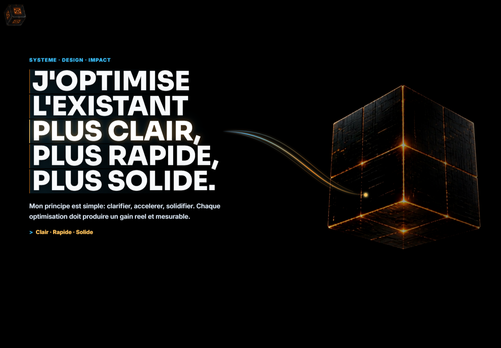
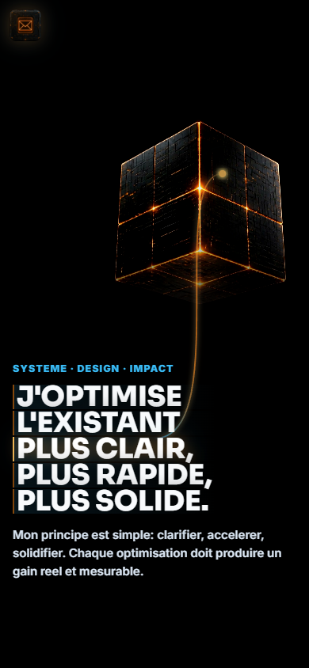

# Site Ma Methode

## Presentation

Site Ma Methode est presente ici avec son concept, ses fonctions, ses choix de conception et ses informations d'utilisation.

## Demarrage rapide

### Pre-requis

- Git installe localement.
- Node.js 20 ou plus recent.
- Gestionnaire de paquets: npm.

### Installer et lancer

```powershell
git clone https://github.com/RYJITS/site_ma_methode.git
cd site_ma_methode
npm install
npm run check
npm run dev
```

## Installation locale

Pour installer le projet localement, Node.js doit être installé. Aucune dépendance applicative n'est requise. Les scripts disponibles permettent de lancer le serveur de développement ou de production.

### Pre-requis
- Node.js installe localement.
- Gestionnaire detecte: npm.
- Creer un fichier `.env` local a partir de `.env.example` si des variables sont necessaires.

### Commandes
```powershell
git clone https://github.com/RYJITS/site_ma_methode.git
cd site_ma_methode
npm install
npm run check
```

## Lancement

```powershell
npm run dev
npm run start
```

## Utilisation

Après installation, accéder au site via un navigateur en local (par défaut sur `http://localhost:3000`). La grille s'affiche avec les projets positionnés. Utiliser la molette de la souris pour zoomer, les flèches ou un cliqué-glissé pour se déplacer, et cliquer sur une carte pour ouvrir sa fiche détaillée. Les fiches contiennent des sections comme 'Application', 'Fonctionnement', 'Conception', etc., ainsi que des liens publics et GitHub si disponibles. La scène de contact permet d'envoyer un message après interaction avec l'interface WebGL.

## Concept

Vitrine interactive et hub des projets. Elle presente la methode de travail, affiche la carte des applications et ouvre des fiches detaillees synchronisees par l'orchestrateur.

Transformer les projets locaux en presentation claire, navigable et diffusable.

Public vise: Visiteurs, partenaires, clients potentiels et suivi personnel.


## Fonctionnement de l'application

Le site importe un module project-registry.js genere par l'orchestrateur. A l'ouverture de la grille, il place les projets par zones, gere le zoom, le deplacement, les boutons de focus et le panneau detail. Quand une carte est ouverte, le panneau affiche l'image, le resume, les statuts, le lien public, le lien GitHub, la fiche, puis les sections Application, Fonctionnement, Conception, Techniques et Automatisations. Le contact passe par une scene interactive et une API PHP dediee.

## Fonctions de l'application

- Affiche une grille navigable de tous les projets.
- Ouvre une fiche simple et lisible pour chaque application.
- Montre les liens publics disponibles quand ils sont autorises.
- Garde les informations sensibles hors de la vitrine.

## Actualisations et evolution

- Intégration d'un registre de projets généré automatiquement par l'orchestrateur pour éviter la maintenance manuelle des cartes
- Ajout d'une scène de contact interactive basée sur WebGL pour une expérience immersive
- Optimisation des vignettes en format WebP pour un chargement plus rapide
- Mise en place d'une vérification automatisée des navigateurs via Playwright pour garantir la compatibilité
- Enrichissement de la documentation avec des rapports fonctionnels et des captures d'écran
- Intégration d'un registre de projets généré automatiquement pour éviter la maintenance manuelle
- Ajout d'une scène de contact interactive basée sur WebGL
- Optimisation des vignettes en WebP pour un chargement plus rapide
- Mise en place d'une vérification automatisée des navigateurs via Playwright
- Enrichissement du README avec des rapports fonctionnels et des captures d'écran
- Enrichissement du README avec des rapports fonctionnels et des captures d'écran pour une meilleure documentation

## Comment le projet a ete reflechi et construit

Il a ete concu comme un hub vivant plutot qu'une liste statique. Le design existant garde la narration immersive, mais la couche projet est maintenant alimentee par les donnees de l'orchestrateur pour eviter de recoder les cartes a la main et pour garder les projets synchronises.

### Outils, IA et moteurs utilises

- Registre fourni par l'orchestrateur
- Fiches Markdown publiques
- Vignettes IA WebP
- Panneau detail dynamique
- Scene contact interactive
- API PHP de contact
- Verification navigateur automatisee
- Regles de non-exposition des secrets
- Vite
- JavaScript modulaire
- CSS responsive immersif
- Video controlee par le scroll
- WebGL pour la scene contact
- Registre JavaScript genere
- Images WebP optimisees
- Verification navigateur avec Playwright

### Options techniques detectees

- Type de projet: node
- Gestionnaire: npm
- Nom package: ai-video-webgl-competences-clean
- Version: 1.0.0
- Lien public: https://cv.c2rdesign.com/

### Stack et dependances principales

- Vite/Dev server
- Node.js
- Vite
- JavaScript modulaire
- CSS responsive immersif
- Video controlee par le scroll
- WebGL pour la scene contact
- Registre JavaScript genere
- Fiches Markdown publiques
- Images WebP optimisees
- Verification navigateur avec Playwright

### Scripts disponibles

- check: node --check scripts/serve.mjs && node --check scripts/qa-iphone.mjs && node --check src/contact-scene.js && node --check src/main.js && node --check src/project-registry.js
- dev: node scripts/serve.mjs
- dev:iphone: node scripts/serve.mjs --host 0.0.0.0
- qa:iphone: node scripts/qa-iphone.mjs
- qa:iphone:headed: node scripts/qa-iphone.mjs --headed
- serve: node scripts/serve.mjs
- start: node scripts/serve.mjs

### Dependances applicatives

- Aucune dependance applicative detectee.

### Dependances de developpement

- Aucune dependance de developpement detectee.

## Automatisations et comportements internes

- Generation automatique de project-registry.js
- Copie des fiches publiques vers public/orchestrator/fiches
- Synchronisation des statuts, liens et vignettes
- Verification du rendu par script Chromium
- Controle que les secrets ne sont pas exposes
- Ouverture QA via parametre qaScroll
- Import des vignettes IA depuis le dossier thumbnails-ai

## Captures d'ecran





## Variables d'environnement

Copier `.env.example` vers `.env` en local puis remplir les valeurs privees.

## Securite

Ne jamais publier `.env`, tokens, sessions, logs sensibles, cles privees ou donnees personnelles.
